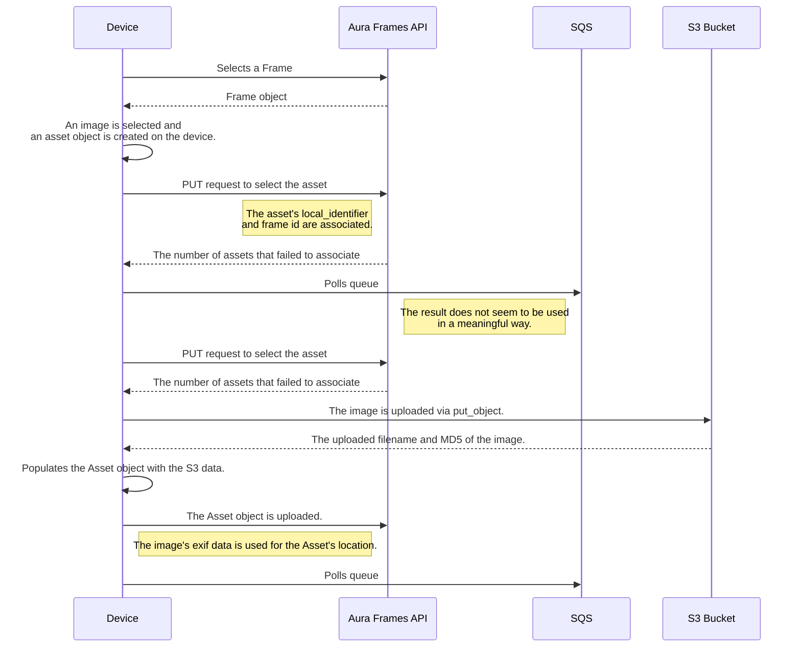

# Aura Frames (PUSHD) Python Client [unofficial]

Implements most of the AuraFrames APIs in Python.

Any advice or issues are welcome.

## Environment Variables Setup
- `AURA_USERNAME`: The username/email of the account to authenticate with.
  - `Aura.login` may optionally be called with a username and password instead of setting env vars.
- `AURA_PASSWORD`: The password of the account to authenticate with.
- `AURA_DEVICE_IDENTIFIER`: The unique identifier of the device to mimic. (Default: `0000000000000000`)
  - Ideally this should be set to your unique identifier, though it accepts others.
- `AURA_LOCALE`: The locale of the device to mimic. (Default: `en-US`)
- `AURA_APP_IDENTIFIER`: The identifier of the aura app. (Default: `com.pushd.client`)
  -  This may change between iOS and Android app implementations, untested.

## iOS/Android Device's Upload Image Flow
[Aura.upload_image](auraframes/aura.py#L101) attempts to implement this flow as closely as possible.
1. A frame is selected and the frame's data is retrieved from the API (`/frames/<frame_id>.json`).
2. An image on the device is selected for upload.
3. An Asset object is created for the image and a GUID (`local_identifier`) is generated.
4. A POST request is made (`/frames/<frame_id>/select_asset.json`) with the asset's `local_identifier`.
   - This allows the asset to be related to a specific frame once the image has been uploaded.
5. SQS is polled (may not be necessary)
   - The result does not seem to be used in a meaningful way.
6. Another `select_asset.json` request is sent with the same information.
7. A `put_object` request is made to the S3 bucket `images.senseapp.co` with the image, the MD5 and uploaded filename are retrieved.
8. The asset object is populated with the S3 response.
9. A PUT request is sent to `/assets/batch_update.json` with the asset information.
    - I believe this is when the location exif data is read from the image file itself and used to populate future asset requests. Manually populating the exif data on the Asset object before sending it does not get returned in future requests.
    - The height and width of the image can be spoofed in the Asset object to produce skewed images, it seems like only the location exif is used.
10. SQS is polled again

## iOS/Android Device's Download/View Image Flow
1. A frame is selected and the frame's data is retrieved from the API (`/frames/<frame_id>.json`).
2. A paginated list of assets is retrieved with the `frame_id` (`/frames/{frame_id}/assets.json`).
3. A URL is built that contains the image proxy URL, the asset's uploaded user id, and the asset's S3 filename.
   - See [export.py](auraframes/export.py)
4. The image is retrieved from the URL.
5. TODO: Describe rendering

### TODOs
- Map out the actual SQS flow.
  - SQS may be polling constantly and used for push notification / update requests.
- Determine if it's possible to have 2 active logins for the same account
- Is it possible to associate an asset to multiple frames? Currently, the device flow uploads the image for each frame, there may be some backend process to dedupe them.
  - Worth checking if the Asset's (S3) filename changes.
- Reverse the _actual_ frame's rendering process. Presumably it uses the same endpoints.
  - Worth checking with MITM proxy before JTAG/firmware dumping.